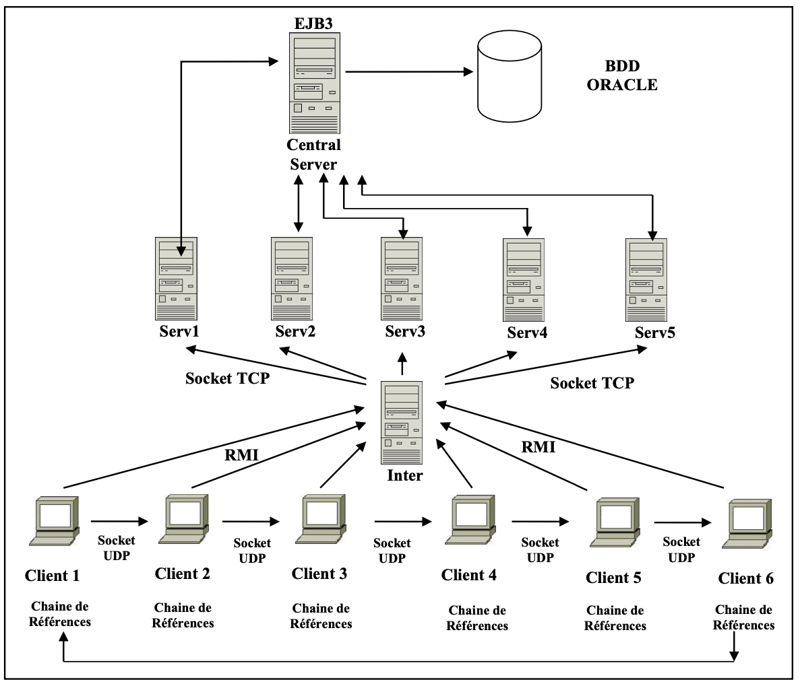
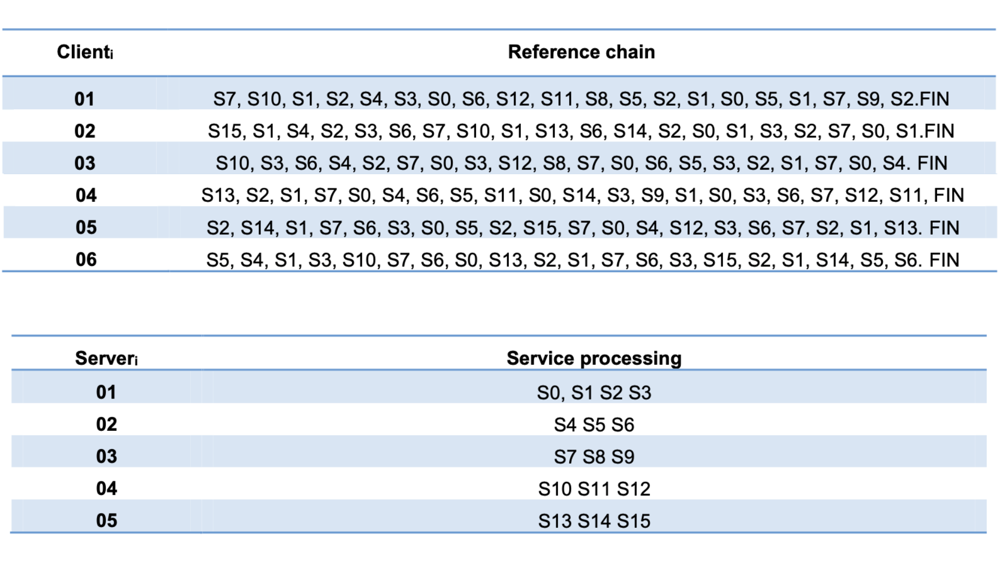

# Mastering-Networked-Java-EJB3-TCP-UDP-and-RMI-in-Harmony

## Tools

- JRE System library [Java SE].
- Eclipse IDE for Enterprise Java and Web Developers (J2EE) – version: 2023.
- WildFly 27.0 Runtime Server.
- TCP/IP Network.
- MySQL Database

## Objective 

The goal of this work is to implement applications that are developed and executed over a network using EJB3
technology, TCP sockets, UDP sockets, and RMI

## Architecture

We consider the architecture of a distributed application which is composed of (see Figure 1):
- Five servers (Serv*i*). Each server must handle a group of service (S1, S2….Sn).
- Six clients (Client*i*). Each client has a reference chain that represents a service requests.
- A central server (Central Server) with a database that hosts services.
- An intermediate server (Inter) that redirects client requests to the corresponding servers (Serv*i*).

## Process

Services are stored in a database. The database contains various services for all clients. Services are identified by a
number, name and description. Before a server (Serv*i*) start communicating, it must register with the central server by
providing the necessary information (IP address, server name, communication port).

Each client sends its various requests to the intermediate server (Inter) which redirects these requests to the associated
server (Serv*i*). Each server (Serv*i*) calls the Central Server which performs service search and retrieval from the
database. Information regarding the requested service must be sent back to the concerned client (Since each client
has a chain of references, a query is sent by reference).

To send their requests, all clients use a sequential method using a rotation token. Clients are initially organized into a
unidirectional logical ring. Only clients that receive the token can send its next request. It is important to monitor the
token (for example, if it is lost due to a network interruption or station failure). To do this, assume that each station has
a TIMER that is reset when a token passes through it. When the station stops sending token, the TIMER will reach the
end. The first station whose TIMER expires launches the algorithm to select a new candidate. It sends deletion
information that moves around the ring and issues a new token.

## Work

To show how it works, we consider the following client reference chains:

## How To Use

In Order to work with this architecture you have to do the following :
- Start the WildFly Server Frist to connect to MySQL DATABSE.
- Run as Java Application the ServerApplication class (this will start all the 5 servers at one time using THREADS).
- Run as Java Application the Inter class.
- Run as Java Application the ClientApplication class (this will start all the 6 clients at one time using THREADS).

